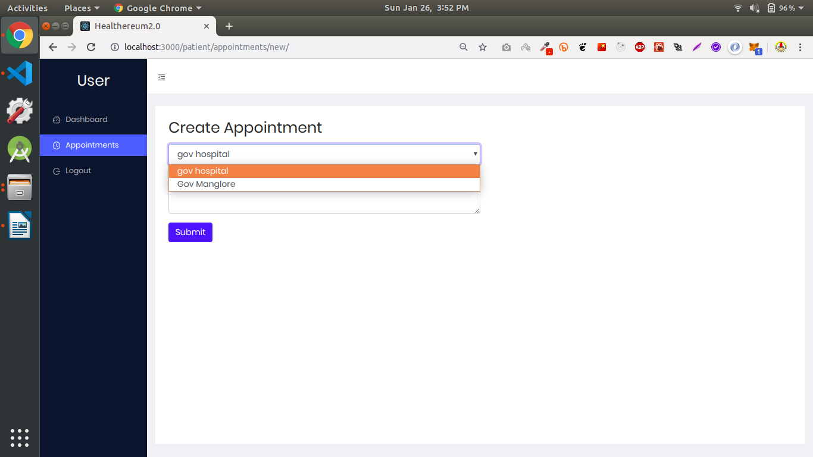
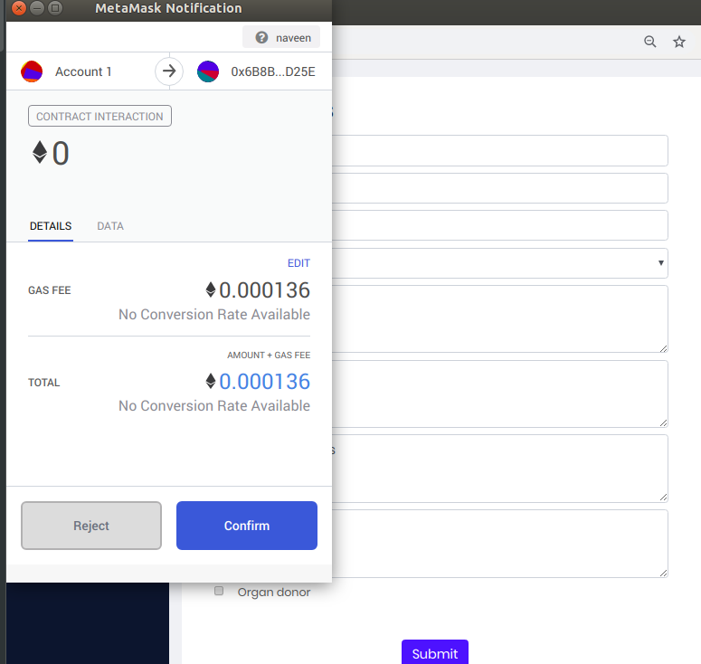
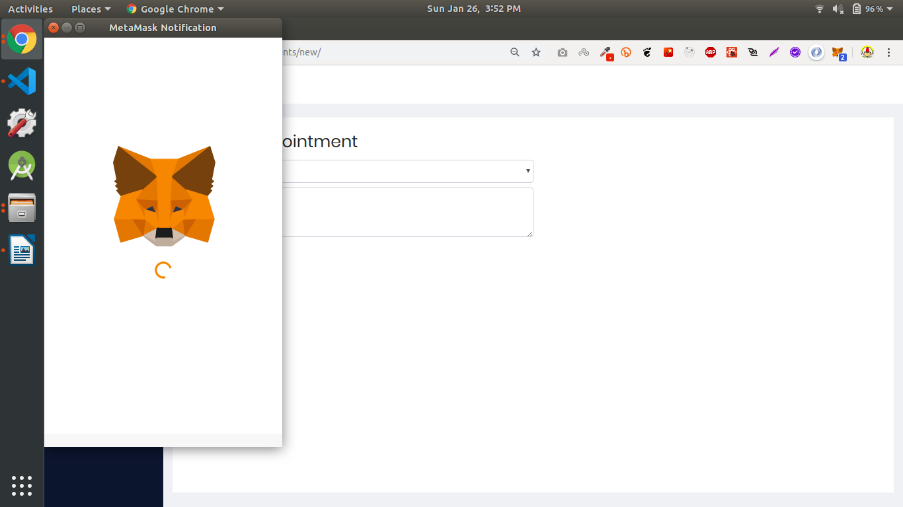
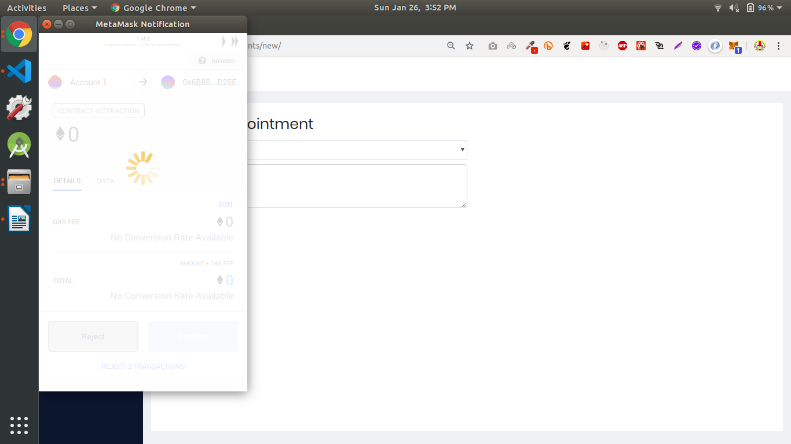
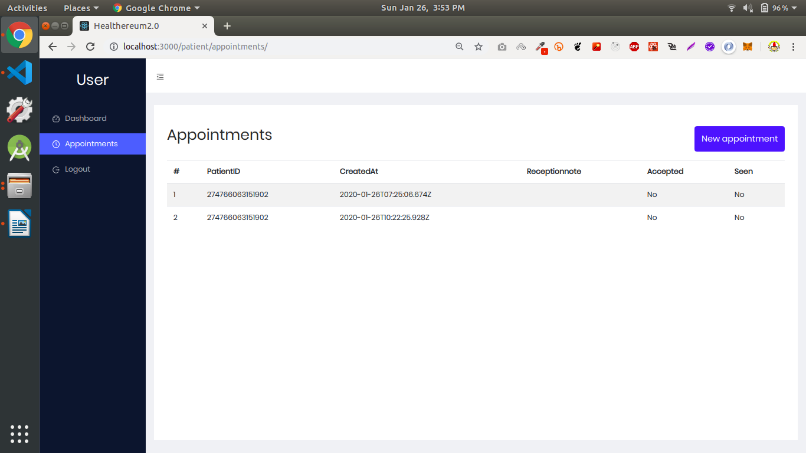

# TEAM NERDY BITS [ HACKVERSE NIT Suratkal ]

## The problem NerdyBits solves

(It is primarily for patients but we have portals even for hospitals, doctors)

### For patients:

1. Data privacy (Medical history of patients)
1. Online Appoinments
1. Emergency situations (SOS buttons, Emergency access to medical history of patient)

### For doctors:

1. Manage appointments
1. View Patients history

### For Hospitals:

1. Approve/Reject Appointments and allot doctors
1. Management dashboard

### Challenges we ran into
1. Running blockchain in android in react-native
1. We thought of an approach using private key from QR Scanner, similar concept to whatsapp scanner.
1. Connecting to web3.js Went deep into documentation to solve the issue
1. Using the Matic Network. After exploring docs and going for some trial and error cycles, we got it right.

## Screenshots:

    
    
    
    
    

